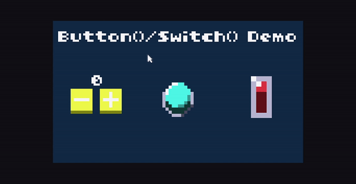

# Title

Short desc

## Controls

How to control

[Click here][cartridge web page] to try the cartridge on the TIC-80 site.

## How to get the code

  **1.** [Download](https://tic80.com/create) and install the TIC-80 on your device.

  **2.** In the software, type `folder` on the console and press ENTER to appear on the screen the storage path. It is where you access the .tic files(the cartridges).
  
  

  **3.** Then you download the cartridge(the .tic file) from the [site][cartridge web page] or [this repository](/source/) and move them to this path.

  **4.** Done. Now you can load and alter the cartridge for your goals.

  

[cartridge web page]:https://tic80.com/play?cart=2628

## See also

[Official TIC-80 site](https://tic80.com/)

[TIC-80 GitHub repository](https://github.com/nesbox/TIC-80/)

[TIC-80 wiki](https://github.com/nesbox/TIC-80/wiki)

[Console commands list](https://github.com/nesbox/TIC-80/wiki/Console#available-commands)

## License

[MIT](LICENSE)
